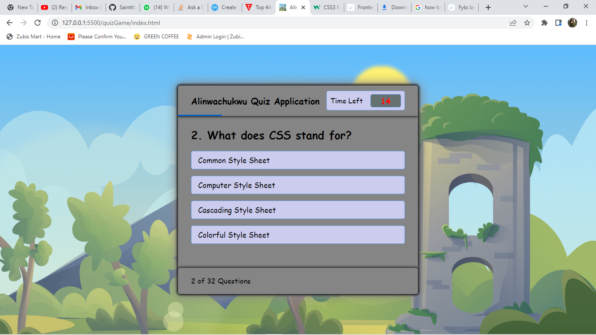

# My Quiz Application

## Table of contents

- [Overview](#overview)
  - [The challenge](#the-challenge)
  - [Screenshot](#screenshot)
  - [Links](#links)
  - [Built with](#built-with)
  - [What I learned](#what-i-learned)
  - [Continued development](#continued-development)
  - [Useful resources](#useful-resources)
- [Author](#author)
- [Acknowledgments](#acknowledgments)

## Overview

### The challenge

- JavaScript was the major challenge. This should fit well on Desktop and mobile views.

### Screenshot

Here are my Desktop and Mobile view screenshots.

.png)
.png)
.png)
.png)
.png)
.png)
.png)
.png)
.png)
.png)
.png)
.png)

### Links

- Live Site URL: [https://remarkable-sopapillas-1aaffa.netlify.app/](https://your-live-site-url.com)
- Live Site URL: [ https://saintt042.github.io/QuizApp/](https://your-live-site-url.com)

### Built with

- Semantic HTML5 markup
- CSS custom properties
- [HTML]
- [CSS]
- [JavaScript]

### What I learned

I learnt a great deal on javaScript while working on this. Also improved more on CSS mediaQuery to be precise.

### Continued development
I would really love to keep building with JavaScript as it is a fun Language to code with.

- [https://stackoverflow.com/](https://www.example.com) - This site really was of great help to me as i got stuck debugging but its guidelines helped me figure it out.

## Author

- Website - [https://saintt042.github.io/First-portfolio/](https://www.your-site.com)
- Twitter - [https://twitter.com/SaintMichaell](https://www.twitter.com/yourusername)

## Acknowledgments
I want to specially thank my team mates<a href = "https://twitter.com/Web3Bridge" target ="_blank">@web3bridge africa</a> for their continued support as we grow together in this tech field and also special thanks to my mentor <a href = "https://twitter.com/jolah99" target ="_blank">@Jolade</a> for her continued encouragement and support. 